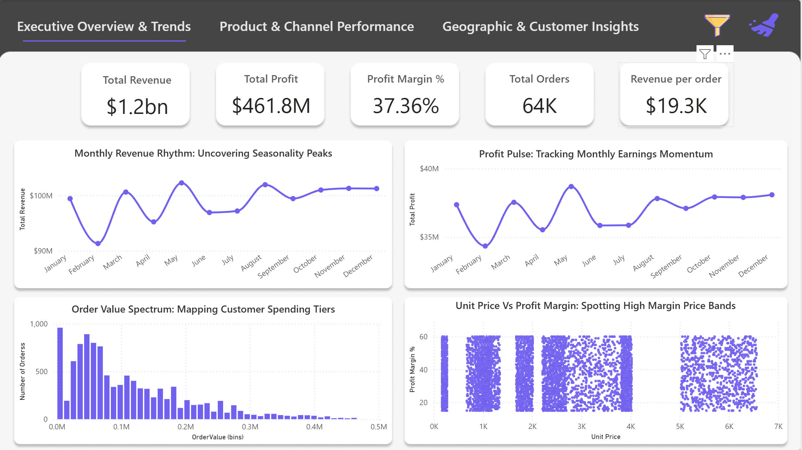
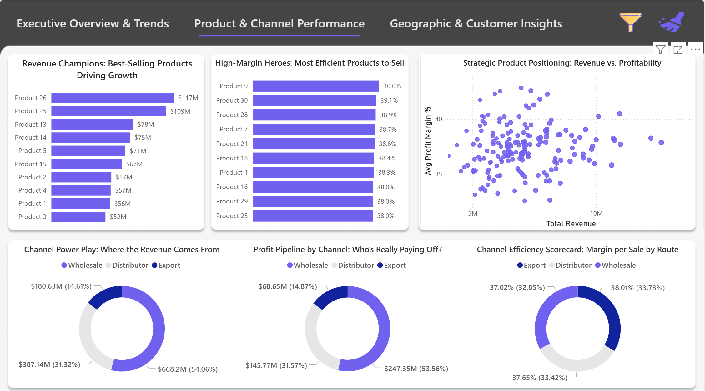
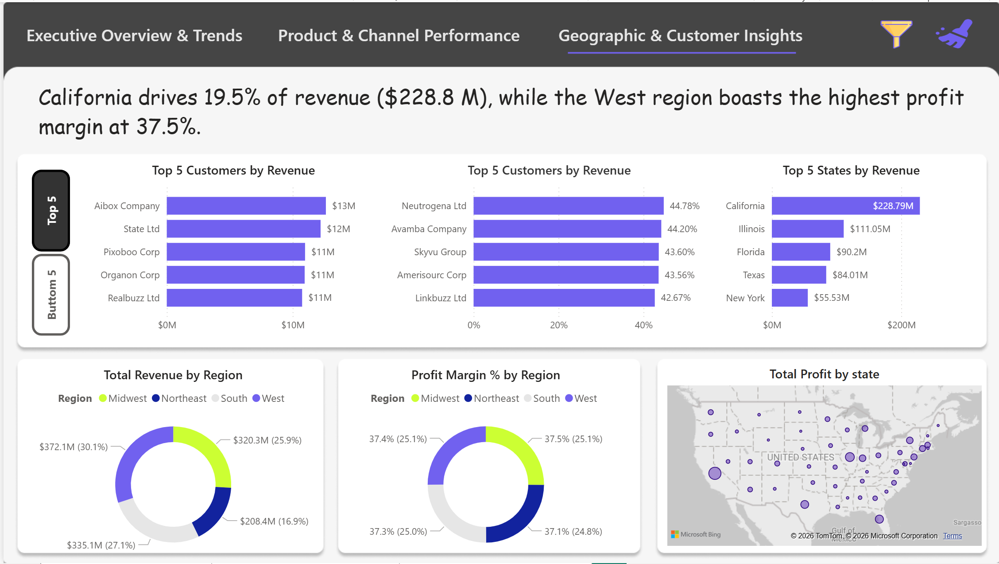

# Regional Sales Performance Analysis 

An end-to-end analytics solution that uncovers regional, channel, and product performance trends from multi-year U.S. sales data using Python and Power BI to support data-driven decision-making.

## 🎯 Business Case

Sales organizations often lack a clear, data-driven view of regional performance. This project analyzes **64,000+ orders** to uncover seasonality, SKU concentration, channel efficiency, and profit drivers, then translates those insights into practical strategic actions.

## 📊 Power BI Dashboard Preview

### Dashboard 1 — Regional Performance Overview


### Dashboard 2 — Channel & KPI View


### Dashboard 3 — Trend & Product Analysis



## 📂 Repository Structure

```bash
├── Regional Sales Dataset.xlsx            # Raw source data (47 states, 175 customers, 30 products)
├── Data Cleaned (Before EDA).csv           # Intermediate cleaned dataset
├── Sales Data (EDA Exported).csv           # Final analytics-ready export
├── Regional Sales Analysis EDA.ipynb      # Python EDA + feature engineering workflow
├── Sales Report.pbix                      # Interactive Power BI dashboard
├── Regional Sales Analysis.pptx   # Executive summary presentation
└── README.md
```

## 💡 Key Insights

- **Seasonality signal:** Revenue drops in **April (~$95M)** versus a **January peak (~$124M)**, indicating a Q2 recovery opportunity.
- **SKU concentration:** **Product 26** and **Product 25** together contribute roughly **25% of total revenue**.
- **Channel dynamics:** **Export** delivers the strongest average margin profile (~38%), while **Wholesale** contributes the largest order volume (~54%).
- **Regional concentration:** **California** is a top-performing market (~7.6K orders; **~$230M** revenue).
- **Profit drivers:** Correlation analysis shows **unit price** is the strongest profit driver (~0.79), while **quantity** has comparatively weaker impact.

## 🚀 Strategic Recommendations

1. **Seasonal campaign design:** Run targeted April recovery promotions and amplify January momentum programs.
2. **SKU portfolio optimization:** Invest in high-performing SKUs (Products 26 & 25) and reassess lower-performing products.
3. **Channel strategy refinement:** Grow Export partnerships for margin expansion; maintain Wholesale with volume-based offers.
4. **Regional playbook replication:** Apply high-performing market tactics to underperforming regions (e.g., Northeast/Midwest).
5. **Margin governance:** Add automated checks for orders below a defined profit margin threshold to surface cost/pricing issues.

## 🛠️ Project Workflow

### Phase 1 — Exploratory Data Analysis (Python)

- Consolidated and validated transactional data.
- Engineered business metrics: `total_cost`, `profit`, `profit_margin_pct`, and monthly date dimensions.
- Performed trend and correlation analysis to identify commercial levers.

### Phase 2 — Business Intelligence (Power BI)

Built an interactive dashboard experience focused on:

- **Performance summary** with KPI and trend monitoring.
- **Customer/channel exploration** for segmentation and contribution analysis.
- **Scenario-style views** supporting decision discussions.

## ⚙️ How to Use

1. **Technical deep dive:** Open `Regional Sales Analysis EDA.ipynb` to review transformation logic and EDA outputs.
2. **Interactive analysis:** Open `Sales Report.pbix` in Power BI Desktop to explore results by region, channel, and month.
3. **Business narrative:** Open `Regional Sales Analysis.pptx` for executive-level recommendations.

## 🧰 Tech Stack

- **Python / Jupyter Notebook** (EDA + feature engineering)
- **Power BI** (interactive reporting)
- **Excel / CSV** (data storage and exchange)
- **PowerPoint** (stakeholder communication)

## 📌 Notes

- Core analytics-ready dataset: `Sales Data (EDA Exported).csv`
- Historical coverage: 2014-01-01 to 2018-02-28
- Scope includes 47 U.S. states, 175 customers, and 30 products

## License

This repository is licensed under the terms in `MIT LICENSE`.
